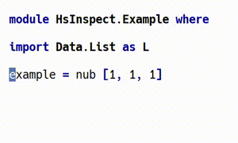
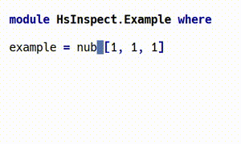
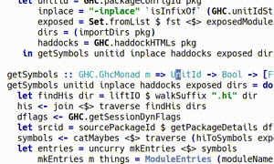

# Haskell Mode: The Next Generation

This is an exploratory alternative to [`haskell-mode`](https://github.com/haskell/haskell-mode/) that answers the question *how would I support Haskell in GNU Emacs if I started today?*

## Why?

`haskell-mode` has been such an important tool for me that I feel the need to explain why I am rewriting it. I have the greatest of respect for its contributors and I have used it for many years.

In [Lessons from 6 Software Rewrites](https://medium.com/@herbcaudill/lessons-from-6-software-rewrite-stories-635e4c8f7c22), the author concludes *"avoid rewrites and make incremental improvements instead, unless you want to a) remove functionality or b) take a different approach"*.

### Remove Functionality

`haskell-mode` is almost 30 years old and has accumulated more than 25,000 lines of code aimed at a wide variety of users from academics to industrial software engineers. I choose to focus on the requirements of the industrial engineer, removing features that are deeply embedded in the design of the original codebase.

### Different Approach

During those past 30 years, the GNU Emacs ecosystem has evolved to provide many features that `haskell-mode` independently implemented, such as [`projectile`](https://github.com/bbatsov/projectile), [`comint`](https://masteringemacs.org/article/comint-writing-command-interpreter), [`highlight-symbol`](https://melpa.org/##/highlight-symbol), [`pretty-symbols`](https://github.com/drothlis/pretty-symbols), [`company`](http://company-mode.github.io), [`yasnippet`](http://joaotavora.github.io/yasnippet/), [`polymode`](https://github.com/polymode/polymode), [`paredit`](https://www.emacswiki.org/emacs/ParEdit) / [`smartparens`](https://github.com/Fuco1/smartparens), [`repl-toggle`](https://github.com/tomterl/repl-toggle), [SMIE](https://www.gnu.org/software/emacs/manual/html_node/elisp/SMIE.html) and [LSP](https://github.com/emacs-lsp/lsp-mode/), to name just a few.

I choose to use idiomatic libraries to provide features, rather than building ground-up solutions. Many shared libraries exist to generalise solutions that were first proposed in `haskell-mode`!

## Goal

I want a Haskell editing experience that lets me efficiently write commercial Haskell, and offers me as much automation as I am happy with.

I believe in helping my neighbours, so this codebase is available publicly and I have included installation instructions. But I do not want the burden of users.

The goals can be achieved in a small codebase with zero dependencies and high test coverage, targeting [Haskell2010](https://www.haskell.org/onlinereport/haskell2010/).

Old versions of `ghc` and extensions to the Haskell language may not be supported, to reduce the complexity of the codebase. For example, [literate Haskell](https://wiki.haskell.org/Literate_programming) will not be supported, and `ghc` language extensions must be justified on a per-case basis. I am sympathetic to language extensions that are popular in the free software and commercial ecosystems.

If it is possible to implement a feature using another minor mode, or command line tool, then I would prefer not to add the feature.

## Install

Check out the source code repository and enable with [`use-package`](https://github.com/jwiegley/use-package).

A full installation may look like the following

```lisp
(use-package popup) ;; dependency of haskell-tng-hsinspect

(use-package haskell-tng-mode
  :ensure nil
  :load-path "/path/to/git/clone"
  :mode ((rx ".hs" eos) . haskell-tng-mode)

  :config
  (require 'haskell-tng-hsinspect)
  (require 'haskell-tng-extra)
  (require 'haskell-tng-extra-abbrev)
  (require 'haskell-tng-extra-hideshow)
  (require 'haskell-tng-extra-company)
  (require 'haskell-tng-extra-projectile)
  (require 'haskell-tng-extra-smartparens)
  (require 'haskell-tng-extra-yasnippet)
  ;; (require 'haskell-tng-extra-cabal-mode)
  ;; (require 'haskell-tng-extra-stack)

  :bind
  (:map
   haskell-tng-mode-map
   ("RET" . haskell-tng-newline)
   ("C-c c" . haskell-tng-compile)
   ("C-c e" . next-error)))
```

## `hsinspect`

The optional command line tool [`hsinspect`](https://gitlab.com/tseenshe/hsinspect) provides semantic information by using the `ghc` api.

To use this feature you must install `hsinspect` command line tool and the `ghcflags` plugin to every `.cabal` file (which can be behind a flag, see the hsinspect docs for more details):

1. `build-tool-depends: hsinspect:hsinspect`
2. `build-depends: ghcflags`
3. add `ghc-options: -fplugin GhcFlags.Plugin`

To find out which module a symbol belongs to, use `M-x haskell-tng-fqn-at-point`. The `haskell-tng-extra-company` package will automatically complete symbols that are in scope.

<!--
recordmydesktop --no-sound --delay 3
ffmpeg -i out.ogv -vf crop=500:300:5:0 fqn-at-point-completion.mp4
ffmpeg -i out.ogv -vf crop=500:300:5:0,scale=300:-1 -hide_banner fqn-at-point-completion.gif


gitlab markdown allows embedded mp4s but it makes them huge, so use gifs
-->



To automatically import a symbol at point, use `M-x haskell-tng-import-symbol-at-point`, which understands the difference between unqualified and qualified symbols.



To jump to the definition of a symbol defined outside the project, use `M-x haskell-tng-jump-to-definition`.



All `hsinspect` commands are heavily cached and never invalidated to maximise availability. If the caches are out of date and no longer useful, run the command again prefixed with `C-u` to force a fresh invocaton of hsinspect.

## Extras

Integrations are provided for common libraries and external applications.

The installation instructions above enable all the integrations. Remove the `require` lines for packages that are unwanted.

Third party Haskell tools must be installed separately (e.g. via `cabal install`):

- [`stack2cabal`](https://hackage.haskell.org/package/stack2cabal)
- [`stylish-haskell`](https://hackage.haskell.org/package/stylish-haskell)
- [`ormolu`](https://github.com/tweag/ormolu)
- `C-c p R` invoke [`fast-tags`](https://hackage.haskell.org/package/fast-tags) via [`projectile`](https://github.com/bbatsov/projectile)

Note that to jump to definition inside the project can also be achieved with `projectile-regenerate-tags` and `projectile-find-tag`.

## Contributing

Bug reports and feature requests are a source of anxiety for me, and encourage an unhealthy customer / supplier relationship between users and contributors.

If you wish to contribute, the best thing to do is to let me know about your copy of this repository and we can take it from there. We may both chose to collaborate in one place.

To run the tests, install [`cask`](https://cask.readthedocs.io/en/latest/guide/installation.html) and type

```
cask install
cask exec ert-runner
```

## Plan

This is the status of core features:

- Navigation:
  - [x] performance-minded `syntax-table`
  - [x] `font-lock` to visually distinguish types and values
  - [x] `sexp` navigation
  - [x] `imenu` population
- Editing:
  - [x] indentation
  - [x] `prettify-symbols` to emulate `UnicodeSyntax`
- Compiling:
  - [x] `haskell-tng-compile` for `cabal` batch commands
  - [x] `stack`, `nix`, `shake`, etc support (customise `haskell-tng--compile-*`)
  - [ ] `comint-mode` based `ghc` repl

### Blue Sky

- `lsp-mode` / [`haskell-ide-engine`](https://github.com/haskell/haskell-ide-engine) for more advanced IDE features.
- Imports
  - company-mode backend specific to import sections that detect context, powered by local hoogle cli
  - expand import list into explicit list (perhaps via `:browse` but better as standalone tool) for symbol-at-point (assuming no shadowing).
  - convert wildcard import to explicit list
  - remove unused imports
- Exports
  - visual indicator of what has been exported (hsinspect could do this for compilable code)
- Hoogle integration
  - build local hoogle database for a project
  - local cli search
  - local / remote search with doc in browser
- `.cabal` editing / navigation
  - add `LANGUAGE` (with auto-populated completions from ghc)
  - helpers to generate version bounds, even if it's just expanding the latest version of a package `cabal gen-bounds`, `cabal outdated`, `cabal-plan`.
  - project wide grep (including dependencies).
  - add `build-depends` based on FQNs and a local index of hackage.
- [`.hie`](https://ghc.haskell.org/trac/ghc/wiki/HIEFiles) files as a parser backend and many type based queries.
- lightweight interactive commands ([`dante`](https://github.com/jyp/dante) / [`intero`](https://github.com/commercialhaskell/intero) / [`hhp`](https://github.com/kazu-yamamoto/hhp)), will be made redundant with `.hie`:
  - `:type` at point
  - `:browse` `company-backend` (see also imports tool above)
  - `:doc` at point
  - expand type definitions (e.g. to show full ADT)
- [`flycheck`](http://www.flycheck.org/en/latest/) integration with `haskell-compile`
  - `ghc` / `cabal exec ghc --` for red squiggles, getting the correct info from [`cabal-helper`](http://hackage.haskell.org/package/cabal-helper)
  - and [`hlint`](https://github.com/ndmitchell/hlint)
  - and for faster feedback, [`ghcid`](https://github.com/ndmitchell/ghcid)
- [visualise values as types](https://twitter.com/jyothsnasrin/status/1039530556080283648)
- [`djinn`](https://hackage.haskell.org/package/djinn) / [`justdoit`](https://hackage.haskell.org/package/ghc-justdoit) integration
- [`pointfree`](https://hackage.haskell.org/package/pointfree) integration
- is there a solution to thinking "right to left" vs writing "left to right"? (easy left token movement?)
- identify trivial / helper functions and forward their `edit-definition` to another location.
- Code gen
  - `instance` boilerplate (populate `where` with functions that are needed)
  - record of functions boilerplate
- Refactoring
  - be compatible with [`apply-refact`](https://github.com/mpickering/apply-refact) / [`hlint-refactor-mode`](https://github.com/mpickering/hlint-refactor-mode)
  - insert explicit list of exports
- Reviewing
  - hide changes to imports when reviewing diffs
